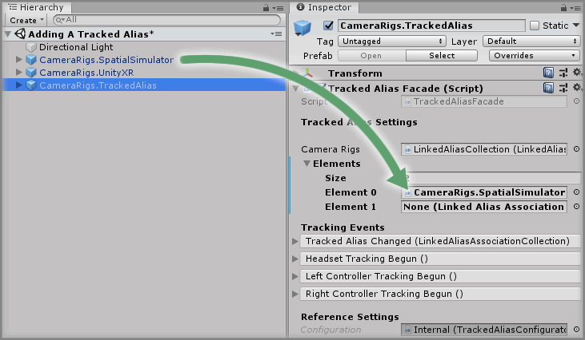
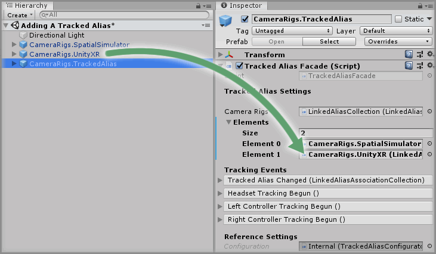
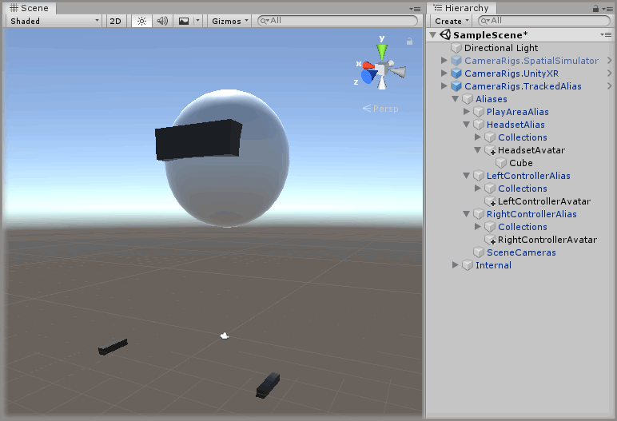

# Adding A Tracked Alias

> * Level: Beginner
>
> * Reading Time: 2 minutes
>
> * Checked with: Unity 2018.3.14f1

## Introduction

The Tracked Alias prefab provides a way of attaching elements to CameraRig configurations without specifically tying them to the underlying SDK CameraRig.

This is useful if you want to support multiple SDK CameraRigs in your scene but don’t want to duplicate the same child GameObjects of all the relevant SDK CameraRigs.

The outcome of this How-To Guide is to learn how to add the multiple supported CameraRig prefabs to the scene and utilize the Tracked Alias prefab to provide trackable aliases for the active SDK CameraRig.

## Prerequisites

* [Add the Tilia.CameraRigs.SpatialSimulator.Unity] prefab to the scene Hierarchy.
* [Add the Tilia.CameraRigs.UnityXR] prefab to the scene Hierarchy.
* [Install the Tilia.CameraRigs.TrackedAlias.Unity] package dependency in to your [Unity] project.

## Let's Start

### Step 1

Expand the `Tilia CameraRigs TrackedAlias Unity` Package directory in the Unity Project window and select then `Packages -> Tilia CameraRigs TrackedAlias Unity -> Runtime -> Prefabs` directory then drag and drop the `CameraRigs.TrackedAlias` prefab into the Hierarchy window.

### Step 2

Select the `CameraRigs.TrackedAlias` GameObject in the Unity Hierarchy window then increase the `CameraRigs -> Elements -> Size` property by `2` on the `Tracked Alias Facade` component.

> The size property will be `0` by default so change it to `2`.

### Step 3

Drag and drop the `CameraRigs.SpatialSimulator` GameObject from the Unity Hierarchy window into the newly displayed Element `0` field within the Elements parameter on the `Tracked Alias Facade` component.

### Step 4

Drag and drop the `CameraRigs.UnityXR` GameObject from the Unity Hierarchy window into the newly displayed Element `1` field within the Elements parameter on the `Tracked Alias Facade` component. Disable the `CameraRigs.UnityXR` GameObject so there is only one active CameraRig in the scene.

### Done

Now you have a TrackedAlias in your scene that will track the first active valid CameraRig that is set in the CameraRigs list. If you play the Unity scene you will have the TrackedAlias linked to the Spatial Simulator as it's first in the list and is the active CameraRig in the scene.

As you move the Spatial Simulator around the scene, the TrackedAlias controllers will follow the orientation of the Spatial Simulator controllers and if you move the TrackedAlias play area then the Spatial Simulator play area will follow along.

If you disable the `CameraRigs.SpatialSimulator` GameObject in the scene and enable the `CameraRigs.UnityXR` GameObject in the scene then the TrackedAlias will switch to following the UnityXR CameraRig in the scene as it has become the next active CameraRig available.

You can now place other GameObjects in the TrackedAlias child GameObjects and they will follow the active SDK Camera Rig without being specifically tied to it.

[Add the Tilia.CameraRigs.SpatialSimulator.Unity]: https://github.com/ExtendRealityLtd/Tilia.CameraRigs.SpatialSimulator.Unity/blob/master/Documentation/HowToGuides/AddingASpatialSimulatorCameraRig/README.md
[Add the Tilia.CameraRigs.UnityXR]: https://github.com/ExtendRealityLtd/Tilia.CameraRigs.UnityXR/blob/master/Documentation/HowToGuides/AddingAUnityXRCameraRig/README.md
[Install the Tilia.CameraRigs.TrackedAlias.Unity]: ../Installation/README.md
[Unity]: https://unity3d.com/